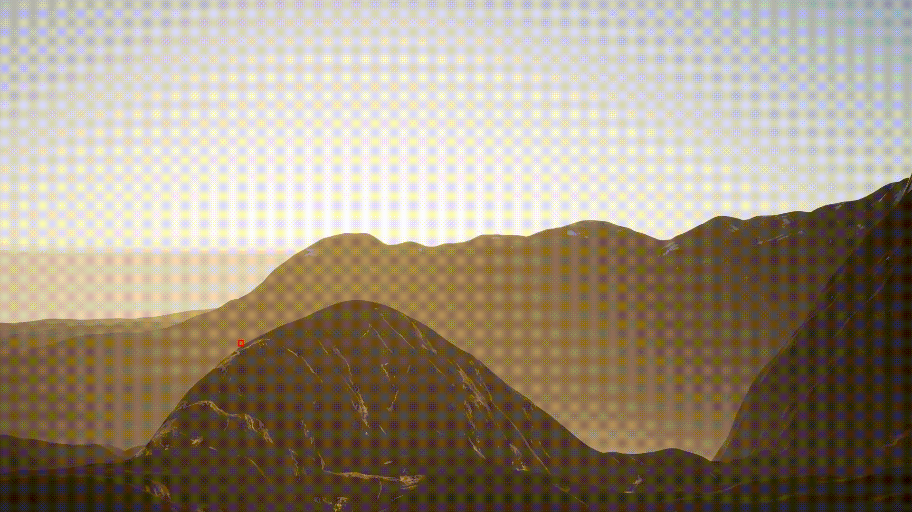

#The Technical Task

Develop a system for automatically detecting and tracking a given object in a video, including determining its location (x, y, z – 3D coordinates).

##Implementation

The problem can be divided into two subtasks:

1. Develop a robust object-tracking neural network to extract the 2D coordinates of the object.
2. Develop the mathematical framework to convert the 2D representation into 3D coordinates.

###Object Tracking

The training dataset consists of RGB and infrared videos from three cameras. The object moves in the same direction across all videos, but the cameras are positioned differently. As a result, the object may disappear from one or more cameras. Additionally, the dataset includes various noise objects that make it difficult to detect the target object in the visual spectrum.

For example, take a look at the following pictures:

 
In the second picture, you cannot detect the object because it is hidden in the fog!

###Combining RGB with IR

To address this issue, my team proposed viewing infrared images as weighted heatmaps that complement RGB images. Essentially, we convert infrared intensity values into colors, where higher values are represented by "hot" colors (e.g., red, yellow) and lower values by "cold" colors (e.g., blue). We then combine these "new" pixels with the RGB pixels.

Here is an example with the second picture:

  
<em>Figure 1: Infrared image.</em>
 
 
  
<em>Figure 2: Modified image.</em>
 

###Training

The proposed model for solving the object detection task can be found here. It is a CLIP-like dual-encoder Transformer. We chose this model because it supports zero-shot object detection, saving a significant amount of time and computational resources, as we did not perform any fine-tuning.

Here are the results:

